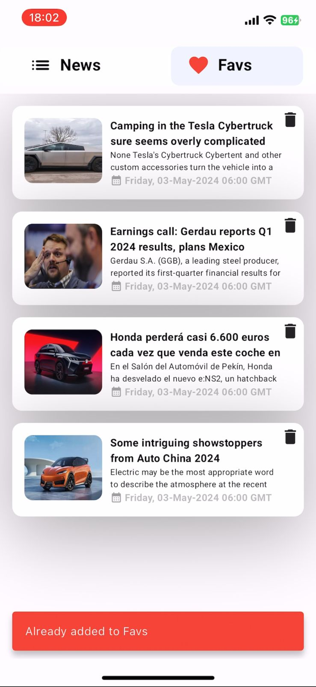

# Project Name
News Article

## Table of Contents
- [Installation](#installation)
[news_app_video.mp4](assets/video/news_app_video.mp4)

## Installation

These are the commands to run this app

1. git clone https://github.com/Amodh2022/news_app.git
2. Add flutter sdk in settings in android studio
3. flutter pub get 
4. flutter run

